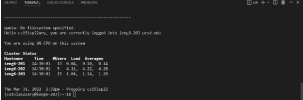
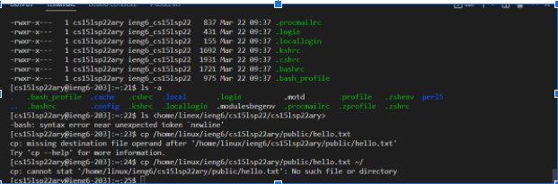
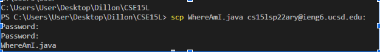
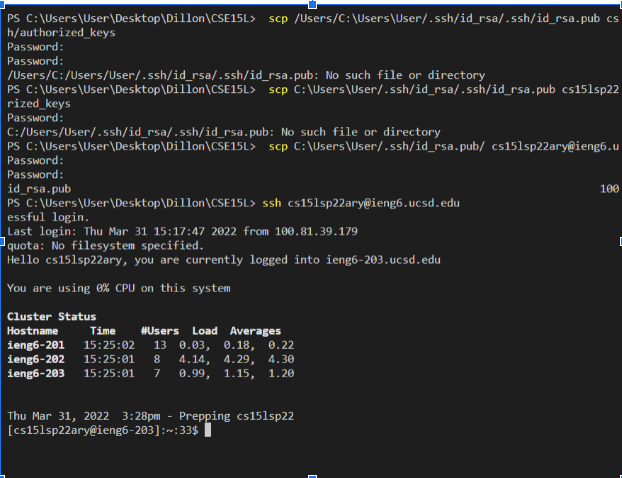
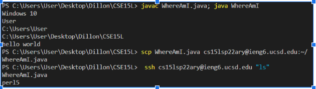

# Lab Report 1

Tutorial: Logging into a ieng6 course specific account

## __Downloading Visual Studios Code__

1) First, click on this [link to download VS code](https://code.visualstudio.com/)
  
2) Download the stable version of whatever computer you have
  

3) Make sure to Follow the instructions given in order to download it.

## __Remotely Connecting to server__

  1) __If on windows__, download [OpenSSH](https://docs.microsoft.com/en-us/windows-server/administration/openssh/openssh_install_firstuse)

2) Find your [UCSD course specific account 
(cs15lsp22(indivdualCharacters)@ieng6ucsd.edu)](https://sdacs.ucsd.edu/~icc/index.php). 
   

3) Open the terminal via Terminal-New Terminal on the menu

4) Write ssh cs15lsp22(individualCharacters)@ieng6ucsd in the terminal

  When logging in for the first time, the terminal will mention a fingerprint.
  Say Yes

  You should have the terminal ask for your passcode. Keep in mind that the CHARACTERS OF THE PASSCODE DOES NOT SHOW when you type stuff

If you got this, you are in

## __Trying Some Commands__

Some Examples:

 cd ~
 :Takes you to the home directory

 cd
:Takes you to the home directory

ls -lat: Gives you a list of files

 ls -a: Gives  you a list of files in a condesded format, without mentioning date or time

 ls /home/linux/ieng6/cs15lsp22/(AnotherPersonsAccount):

 Lists the directories of someone else on ieng6

 cp /home/linux/ieng6/cs15lsp22/public/hello.txt :Copies file hello.txt unless we do not have access to that file

 cat /home/linux/ieng6/cs15lsp22/public/hello.txt:

 Opens hello.txt, unless we do not have access to that file

In order to log out of sever, press Ctrl  d or type exit on the terminal

## __Moving Files with scp__

The command *scp* allows to copy one or many files from your computer to a remote computer

However, IT CAN ONLY BE USED FROM YOUR COMPUTER/CLIENT. You cant use whe connected to a server like ieng6

1) On your terminal, write scp yourCode.java cs15lsp22(YourAccountCharacters):

2) Write your passcode to move your file. You can check if its there by logging into the server and running ls

Significance: Allows to run code on a remote server

## __SSH Keys__

In order to avoid writing passcode constantly every time when writing SSH, we can create  keys via a program called ssh-keygen

1) On your client, type ssh-keygen on your terminal. If on windows, write ssh-keygen -t ed25519

2) When the terminal asks for a passphrase, dont put anything

  When the terminal shows a randomart image, you are on the right track

  A message from the terminal should state where your public key is saved in. Keep that in mind 

3) After that, copy the public key to the .ssh directory on your account in the server

    1)first log in via ssh
 
   2)then make a directory with this command:

      mkdir .ssh

   3)Log out and return to the client

   4)Write scp (location wherePublicKeyisSavedin)/cs15lsp22(AccountCharacters)@ieng5.ucsed.edu:~/.ssh/authorized_keys

## __Optimizing Remote Running__

The example at the bottom has me running the code on my local computer, scp it, then ssh it to confirm that is there. A total of 4 keystrokes.

Lab report summary done!