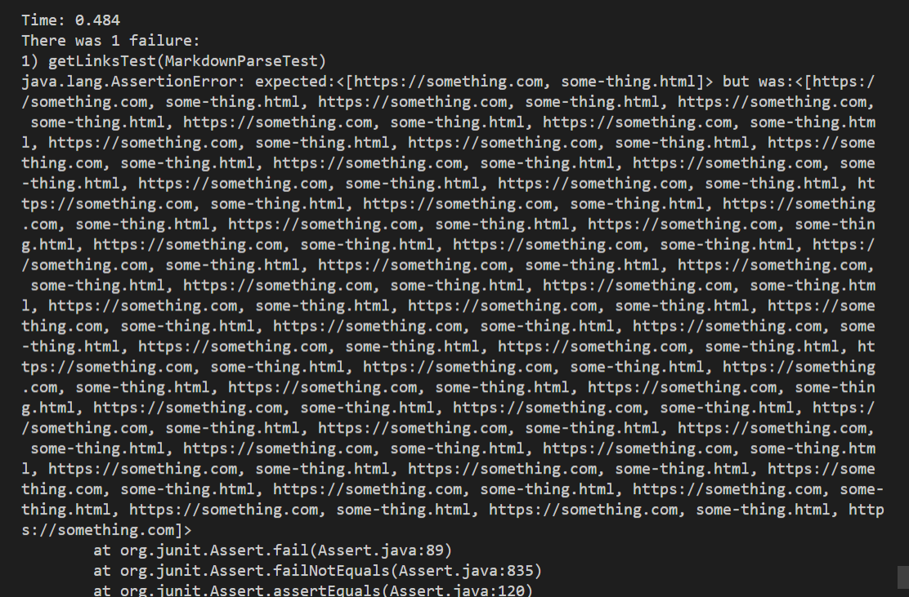
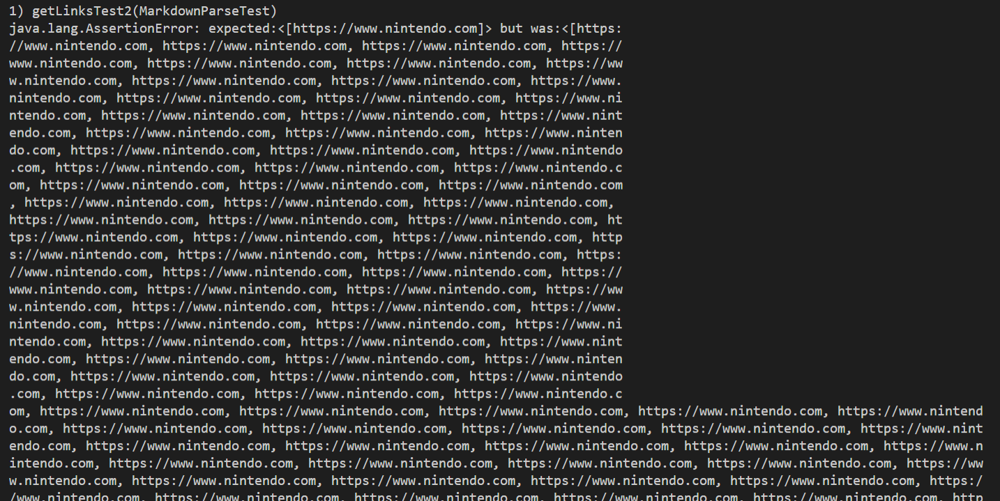
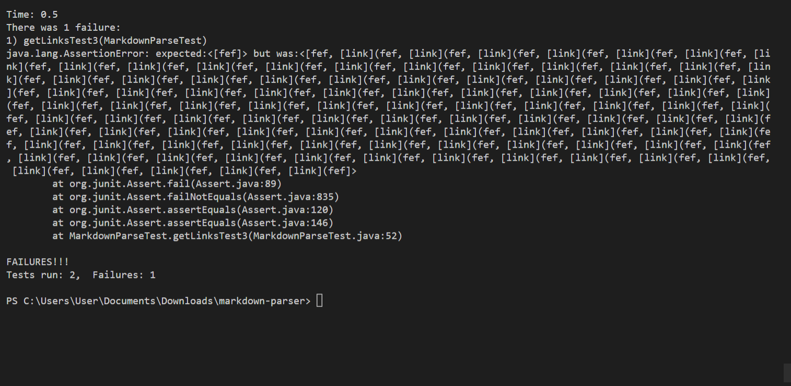

# Lab Report 2

## Markdown Code Before and After

*This screenshot shows all the changes I will talk about at once!*

Fyi-the if statement to stop the while loop for infinte loops before the changes was created by me. This does assume that all the times the while loop finishes by 100 times means the loop is infinte, putting a limit in the number of markdown statements that can be made.

## Test File 1 Failure

[TestFile1](https://github.com/Firecrafter703/markdown-parser/blob/main/test-file.md)

The bug lies in the fact that the MarkdownCode does not recgonize when there are no more markdown statement if a new line is added. If there is an empty spaces added, then the while loop assumes there are more aspects to take note of. This happens through a failure to recognize the open bracket, giving openBracket a value of -1. This in turn affects all the other variables, leading up to the current index always be a fixed number, never breaking out of the while loop. This creates the sympton of an infinite while loop. When my infinite checker if statemetn eventually runs, the arrayList now has way too many links then what the tester was expecting.

Stopping the bug:openBracket cannot be negative 1, I must break the while loop if it is.

## Test File 2 Failure

[TestFile2](https://github.com/Firecrafter703/markdown-parser/blob/main/Test-file2.md)

The bug revolves around a case that does not account if a closed bracket does note exist. Because a closed bracket does not exist, closeBracket is always -1, making openParen and CloseParen the same number always. This is in turn makes currentIndex the same number, creating the sympton of the while loop running infinitly. Eventually, my infinite loop check case ends the loop, but now the ArrayList is bigger then what the test was expecting. 

Stopping the bug:closeBracket cannot be negative 1, I must break the while loop if it is.

## Test File 3 Failure

[TestFile3](https://github.com/Firecrafter703/markdown-parser/blob/main/test-file3.md)

Without a closed parentheses, closeParen in all loops will always be a -1, effectvely forcing the current idnex to always be 0. This bug creates the sympton with a maintained while loop. Eventually, when the while loop is ended by my infinite loop check case, there is an infinte amount of the links added to the arrayList, which the test was not expecting. 

Stopping the bug:closeParen cannot be negative 1, I must break the while loop if it is.

