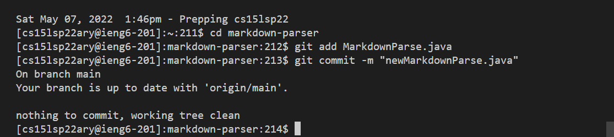
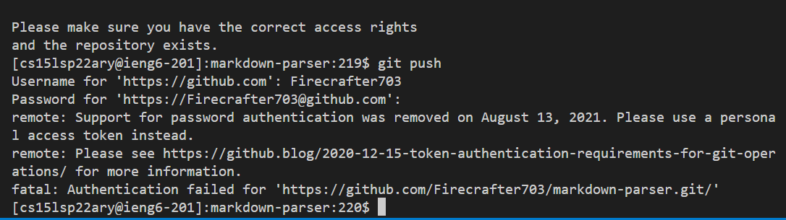
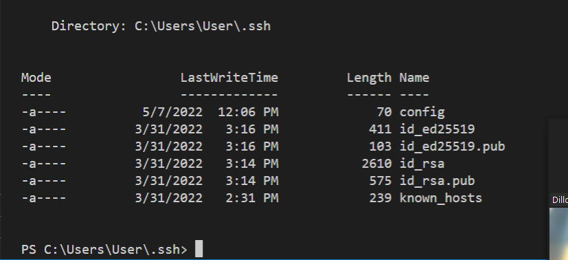
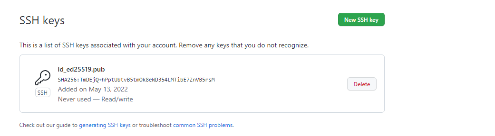
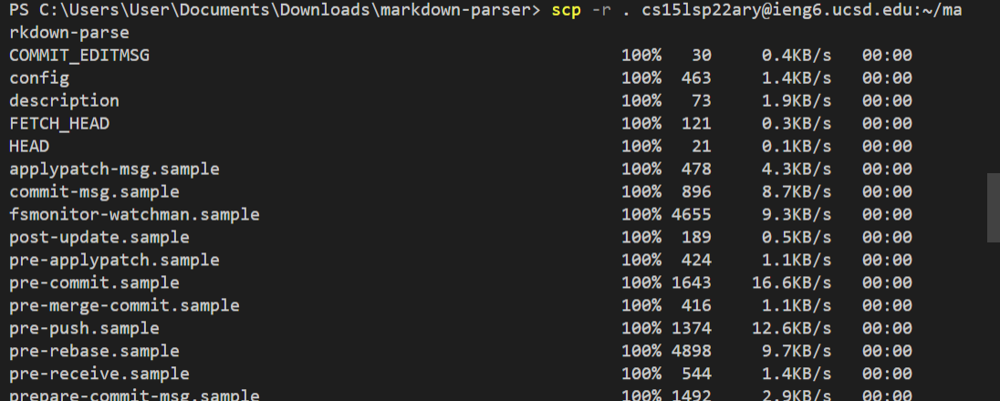
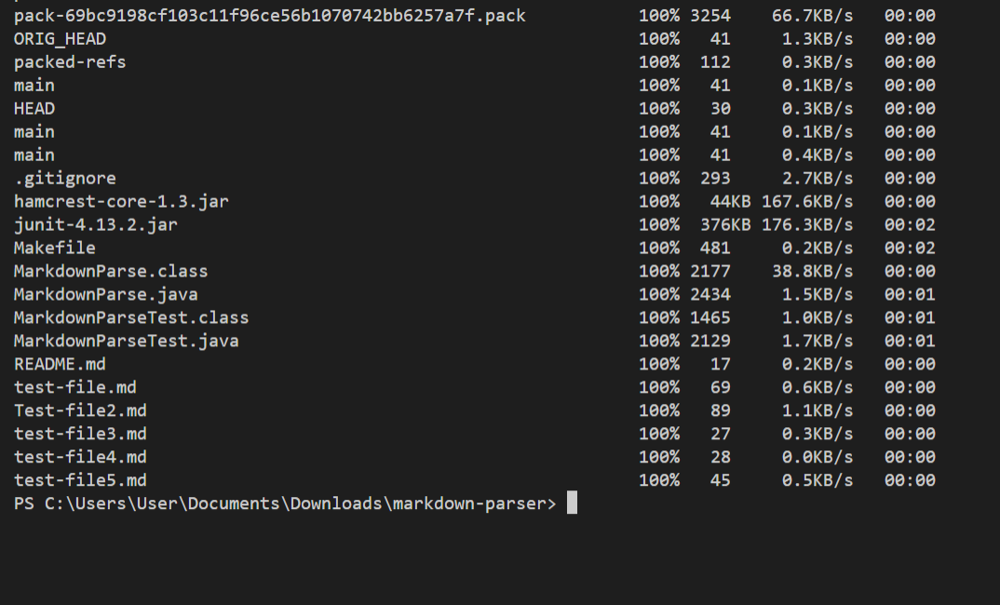
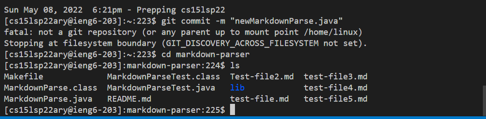

# Lab Report 2

## Streamling ssh Configuration

I had to create a new ssh file, and connect it to users. This phot0 shows the configuration and the logging in.

scp command copying file to account

## Setup Github Access from ieng6

Me using git add and git commit.

Private key of the screenshot

Key in GitHub

## Copy whole directories with scp -r

Me running the command.

Proof that the files are in there. I do not know how to run the tests however.