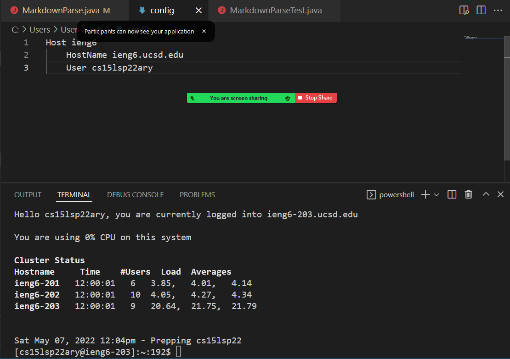
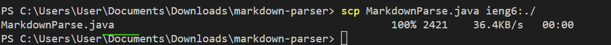

# Lab Report 2

## Streamling ssh Configuration

I had to create a new ssh file, and connect it to users. This phot0 shows the configuration and the logging in.

scp command copying file to account

## Setup Github Access from ieng6

Me using git add and git commit.

Private key of the screenshot

Key in GitHub

This is my attempt at trying to push via server.

## Copy whole directories with scp -r

Me running the command.

Proof that the files are in there. 

Me running the tests on ieng6 server.

This is me running combining scp and ssh commands while also running the Junit Tests

This command copies the directory itself to the Ieng6 server.

This command does the same thing as the previous server, but more stuff is being copied, so its not as fast as the previous command.