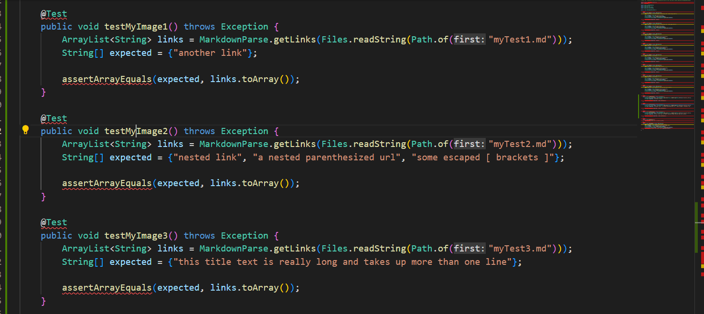

## Lab report 4

# MyCodeReview

Test 1

What could have been done:

Test 2

What could have been done:

Test 3

What could have been done:

# OtherCodeReview

Test 1

What could have been done:

Test 2

What could have been done:

Test 3

What could have been done: