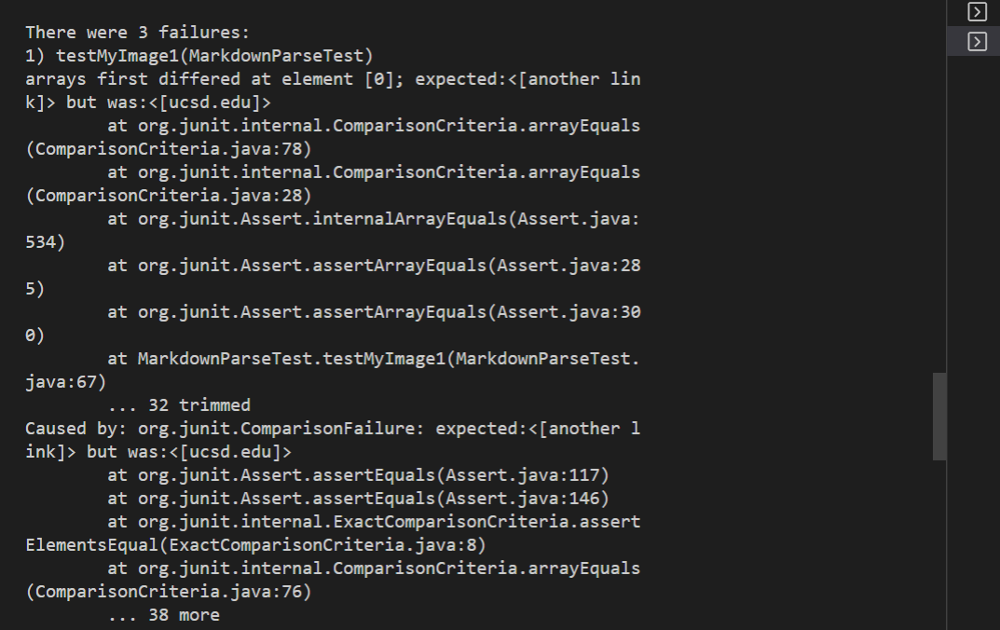

## Lab report 4

# MyCodeReview

Test 1

Test 2

Test 3

# OtherCodeReview

Test 1

Test 2

Test 3

## Comments for my Code

Failure Test 1:

I think there would be a way to fix the code in less than 10 lines. One would have to account for the ‘’, and how that would change the markdown code. That can be written within 4-5 lines for this code.

Failure Test 2:

I don't think there would be a way to fix the code in less then 10 lines, because one would have to account for multiple versions of [] and (). As an example, the snippet in markdown format would expect the line [apple[banana] to just have banana be the word, because that would be the only word closed by the brackets.

Failure Test 3:

I don't think there would be a way to fix the code in less than 10 lines. Snip 3 in markdown form expects to account for the number of characters in order to confirm if a text takes up more than one line. If it takes more than 1 line, the word inside the brackets is not put as a link. Writing lines to account for the spaces and whether the text takes up more then one line will take more than 10 lines.
