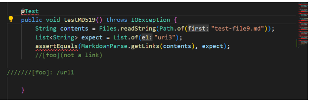
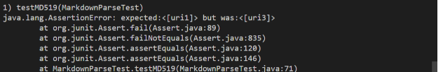
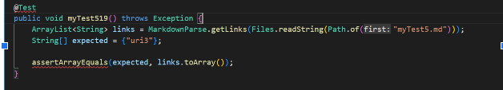
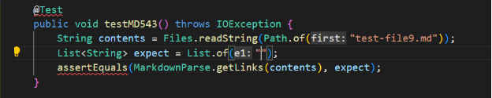
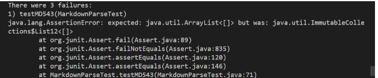
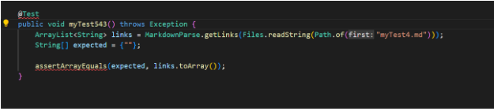
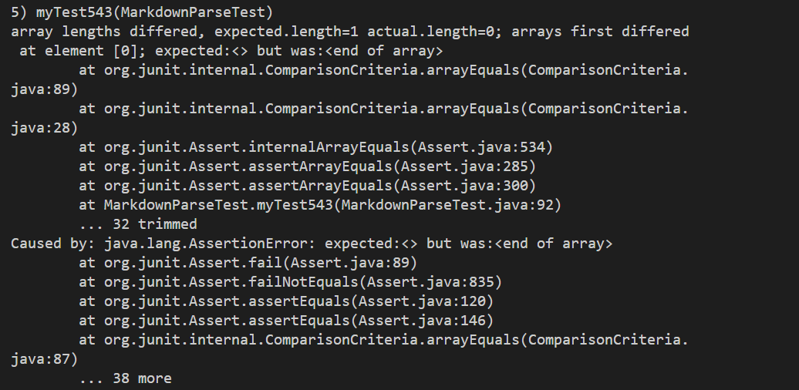
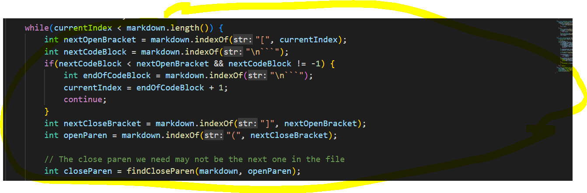
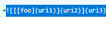
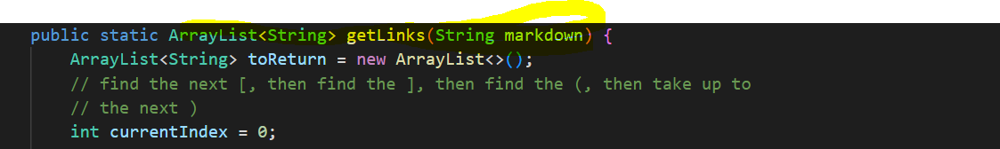

# Lab Report 5

I found the tests with different results manually. I went through the tests, copied them and tested them on both the Lab9 code and my code, and see if they were different.

Link with tests:

[Test519](https://github.com/nidhidhamnani/markdown-parser/blob/main/test-files/519.md)

[Test543](https://github.com/nidhidhamnani/markdown-parser/blob/main/test-files/543.md)

## Test 519

Url3 should be the output. However, both outputs give the wrong answer.

Lab9 implementation

My implementation

## Test 543

The output sohuld just be blank. however, both outputs give the wrong answer.

Lab9 implementation

My implementation

## Describing the bugs

Lab9Test 519:

The code is not taking the correct url(url3), instead taking the first url inside the parentheses, which is located inside the brackets. We need the code to take the correct url in the corrent paretheses(not in brackets), meaning that we need to have a change in the part of the code involving the use of [] and ()/

Lab9Test 543

 
 ImmutableCollections error usually means that there is a problem with the variable types. As a result, it might be best to begin finding a varialbe that can deal with the multitude of types.